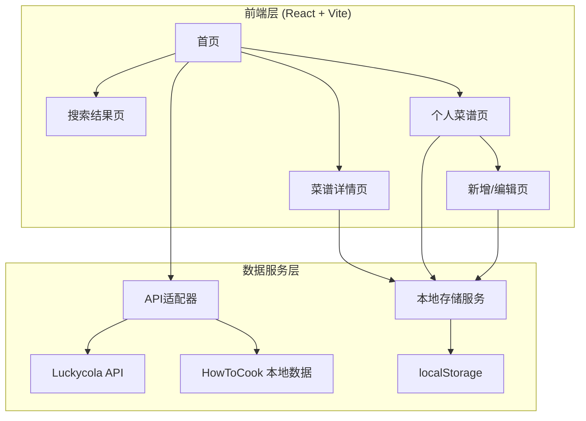
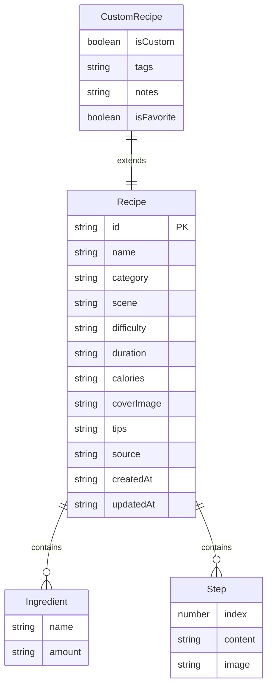

## 1. 架构设计



## 2. 技术说明

- **前端**：React@18 + TypeScript + TailwindCSS@3 + Vite
- **初始化工具**：vite-init (react-ts 模板)
- **后端**：无独立后端，前端直连API + 本地存储
- **数据库**：localStorage（JSON序列化存储个人菜谱数据）
- **状态管理**：Zustand
- **路由**：react-router-dom@6
- **图标**：lucide-react

## 3. 路由定义

| 路由 | 用途 |
|------|------|
| `/` | 首页，搜索+分类+推荐 |
| `/search` | 搜索结果页，筛选+列表 |
| `/recipe/:id` | 菜谱详情页 |
| `/my-recipes` | 个人菜谱页（收藏+自定义+分类） |
| `/recipe/new` | 新增自定义菜谱 |
| `/recipe/:id/edit` | 编辑菜谱 |

## 4. API定义

### 4.1 Luckycola 食谱API

**搜索菜谱**

```
POST https://luckycola.com.cn/food/getFoodMenu
Content-Type: application/json

请求体：
{
  "foodTitle": "红烧鱼",
  "appKey": "<APP_KEY>",
  "uid": "<UID>"
}

响应体：
{
  "code": 0,
  "msg": "食谱获取成功",
  "data": {
    "foodMenu": [
      {
        "id": "8529",
        "title": "家常红烧鱼块",
        "intro": "用家常的简单普通的调料...",
        "image": "",
        "ingredients": {
          "胖头鱼": "一条（1斤左右）",
          "菜籽油": "适量"
        },
        "steps": [
          { "index": 1, "image": "", "content": "将鱼洗净切好..." }
        ],
        "notice": "1：倒入油后...",
        "level": "普通",
        "craft": "烧",
        "duration": "廿分钟",
        "flavor": "原味",
        "tags": []
      }
    ]
  }
}
```

### 4.2 HowToCook 本地数据

HowToCook数据以JSON文件形式内嵌在前端项目中，通过静态导入加载。

**数据结构**（从Markdown解析后的JSON）：

```typescript
interface HowToCookRecipe {
  id: string;
  name: string;
  category: 'vegetable_dish' | 'meat_dish' | 'aquatic' | 'breakfast' | 'staple' | 'soup' | 'drink' | 'condiment' | 'dessert' | 'semi-finished';
  difficulty: number; // 1-5星
  ingredients: Array<{ name: string; amount: string }>;
  steps: Array<{ index: number; content: string }>;
  tips: string;
  source: 'howtocook';
}
```

### 4.3 统一菜谱数据模型

```typescript
// 公共字段（API菜谱与自定义菜谱共用）
interface Recipe {
  id: string;
  name: string;
  category: string;
  scene: string;
  difficulty: string;
  duration: string;
  calories: string;
  coverImage: string;
  ingredients: Ingredient[];
  steps: Step[];
  tips: string;
  source: 'luckycola' | 'howtocook' | 'custom';
  createdAt: string;
  updatedAt: string;
}

interface Ingredient {
  name: string;
  amount: string;
}

interface Step {
  index: number;
  content: string;
  image?: string;
}

// 自定义扩展字段
interface CustomRecipe extends Recipe {
  isCustom: boolean;
  tags: string[];
  notes: string;
  isFavorite: boolean;
}
```

### 4.4 本地存储API

```typescript
// 存储键
const STORAGE_KEYS = {
  FAVORITES: 'recipe_favorites',    // 收藏的菜谱
  CUSTOM_RECIPES: 'custom_recipes',  // 自定义菜谱
  SEARCH_HISTORY: 'search_history',  // 搜索历史
};

// 存储服务接口
interface StorageService {
  getFavorites(): Recipe[];
  addFavorite(recipe: Recipe): void;
  removeFavorite(id: string): void;
  isFavorite(id: string): boolean;

  getCustomRecipes(): Recipe[];
  addCustomRecipe(recipe: Recipe): void;
  updateCustomRecipe(id: string, recipe: Partial<Recipe>): void;
  deleteCustomRecipe(id: string): void;

  getSearchHistory(): string[];
  addSearchHistory(keyword: string): void;
  clearSearchHistory(): void;
}
```

## 5. 数据模型

### 5.1 数据模型定义



### 5.2 HowToCook 数据预处理

HowToCook原始数据为Markdown格式，需预处理为JSON：

1. 从GitHub仓库 `dishes/` 目录获取所有 `.md` 文件
2. 解析Markdown提取：标题、食材清单、步骤、小贴士
3. 根据目录结构确定分类（荤菜/素菜/水产等）
4. 根据文件所在 `starsystem/` 目录确定难度等级
5. 输出为 `src/data/howtocook-recipes.json` 静态文件

## 6. 项目目录结构

```
src/
├── components/          # 通用组件
│   ├── RecipeCard.tsx   # 菜谱卡片
│   ├── SearchBar.tsx    # 搜索栏
│   ├── CategoryNav.tsx  # 分类导航
│   ├── IngredientList.tsx # 食材清单
│   ├── StepList.tsx     # 步骤列表
│   ├── TipsBox.tsx      # 提醒框
│   └── FilterBar.tsx    # 筛选栏
├── pages/               # 页面
│   ├── Home.tsx         # 首页
│   ├── Search.tsx       # 搜索结果页
│   ├── RecipeDetail.tsx # 菜谱详情页
│   ├── MyRecipes.tsx    # 个人菜谱页
│   └── RecipeEdit.tsx   # 新增/编辑页
├── hooks/               # 自定义Hooks
│   ├── useRecipes.ts    # 菜谱数据Hook
│   └── useStorage.ts    # 本地存储Hook
├── services/            # 服务层
│   ├── luckycola.ts     # Luckycola API服务
│   ├── howtocook.ts     # HowToCook数据服务
│   └── storage.ts       # 本地存储服务
├── store/               # Zustand状态管理
│   └── recipeStore.ts   # 菜谱状态
├── data/                # 静态数据
│   └── howtocook-recipes.json # HowToCook预处理数据
├── types/               # 类型定义
│   └── recipe.ts        # 菜谱相关类型
├── utils/               # 工具函数
│   └── helpers.ts       # 辅助函数
├── App.tsx              # 应用入口
└── main.tsx             # 渲染入口
```
